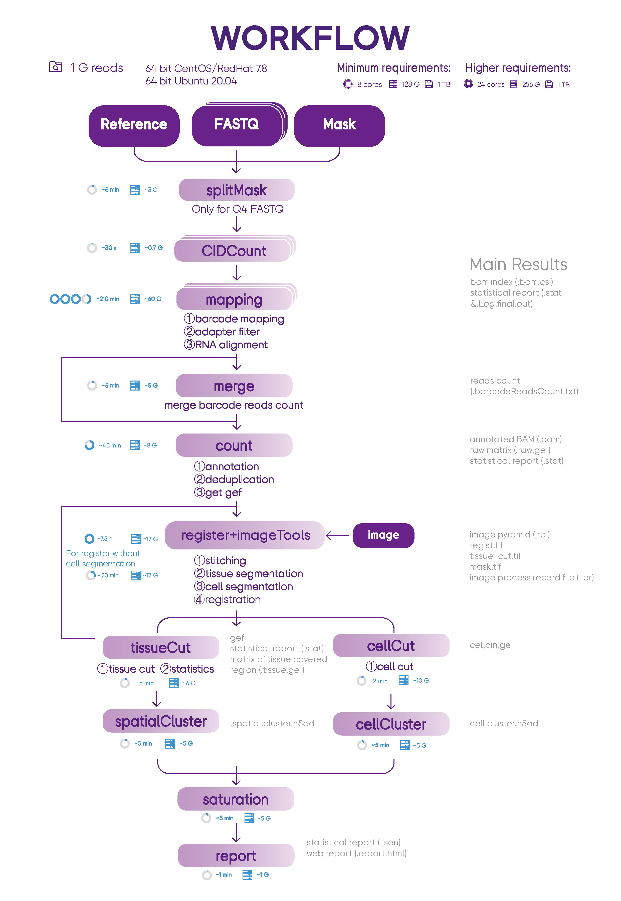
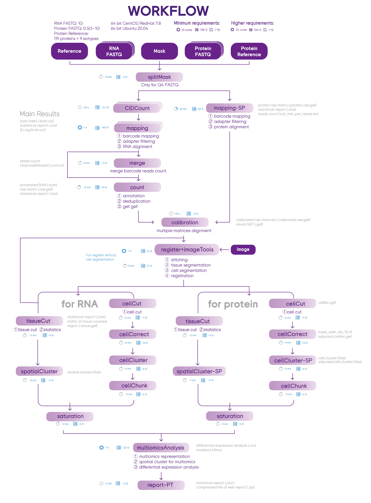

# What's new ?!!!

## New Form

SAW (>= 8.0) is released as a self-contained tar.gz file that can be unpacked directly on the system, without the need to configure the computing environment. Because it has assembled all of the software-required dependencies, which are pre-compiled to run on most Linux distributions.
You can download new SAW through our [STOmics website](https://en.stomics.tech/products/stomics-software/stomics-offline-software/list.html).

## New Entry

If you want to download SAW (>= 8.0), demo datasets and consult user manuals, please visit our [software manual](https://en.stomics.tech/service/new-saw-operation-manual.html).

...

# SAW: Stereo-seq Analysis Workflow
Workflow for analyzing Stereo-seq transcriptomic data. Stereo-seq Analysis Workflow (SAW) software suite is a set of pipelines bundled to map sequenced reads to their spatial location on the tissue section, quantify the corresponding gene expression levels and visually present spatial gene expression distribution.

##  Introduction
SAW processes the sequencing data of Stereo-seq to generate spatial gene expression matrices, and the users could take these files as the starting point to perform downstream analysis. SAW includes thirteen essential and suggest pipelines and auxiliary tools for supporting other handy functions.


SAW Proteomics & Transcriptomics workflow process sequencing data from one-chip to generate spatial gene and protein expression matrices. You can use these two omics information to start higher-dimensional research. This workflow includes 23 essential and suggest pipelines.

##  System Requirements
###   Hardware
Stereo-seq Analysis Workflow (SAW) should be run on a Linux system that meets the following requirements:
* 8-core Intel or AMD processor (>24 cores recommended)
* 128GB RAM (>256GB recommended)
* 1TB free disk space or higher
* 64-bit CentOS/RedHat 7.8 or Ubuntu 20.04

###   Software
* Docker: a container platform, >=20.10.8
* Singularity: a container platform, >=3.8
* SAW in the Singularity Image File (SIF) format
* ImageStudio >= v3.0
* StereoMap >= v3.1

####   Quick installation of Singularity
```
## On Red Hat Enterprise Linux or CentOS install the following dependencies:
$ sudo yum update -y && \
     sudo yum groupinstall -y 'Development Tools' && \
     sudo yum install -y \
     openssl-devel \
     libuuid-devel \
     libseccomp-devel \
     wget \
     squashfs-tools \
     cryptsetup

## On Ubuntu or Debian install the following dependencies:
$ sudo apt-get update && sudo apt-get install -y \
    build-essential \
    uuid-dev \
    libgpgme-dev \
    squashfs-tools \
    libseccomp-dev \
    wget \
    pkg-config \
    git \
    cryptsetup-bin

## Install Go
$ export VERSION=1.14.12 OS=linux ARCH=amd64 && \
    wget https://dl.google.com/go/go$VERSION.$OS-$ARCH.tar.gz && \
    sudo tar -C /usr/local -xzvf go$VERSION.$OS-$ARCH.tar.gz && \
    rm go$VERSION.$OS-$ARCH.tar.gz

$ echo 'export GOPATH=${HOME}/go' >> ~/.bashrc && \
    echo 'export PATH=/usr/local/go/bin:${PATH}:${GOPATH}/bin' >> ~/.bashrc && \
    source ~/.bashrc

## Install singularity on CentOS without compile
$ yum install -y singularity
```
**For additional help or support, please visit https://sylabs.io/guides/3.8/admin-guide/installation.html**

####   Quick download SAW from DockerHub
Currently, the latest version of SAW in DockerHub is 07.1.0. You can download SAW by running the following command:
```
singularity build SAW_<version>.sif docker://stomics/saw:<version>
```
#####   All accessible versions on DockerHub
```
singularity build SAW_7.1.sif docker://stomics/saw:07.1.2
singularity build SAW_7.0.sif docker://stomics/saw:07.0.1
singularity build SAW_6.1.sif docker://stomics/saw:06.1.4
singularity build SAW_6.0.sif docker://stomics/saw:06.0.2
singularity build SAW_5.5.sif docker://stomics/saw:05.5.4
singularity build SAW_5.4.sif docker://stomics/saw:05.4.0
singularity build SAW_5.1.sif docker://stomics/saw:05.1.3
singularity build SAW_4.1.sif docker://stomics/saw:04.1.0
singularity build SAW_4.0.sif docker://stomics/saw:04.0.0
singularity build SAW_2.1.sif docker://stomics/saw:02.1.0
singularity build SAW_2.0.sif docker://stomics/saw:02.0.0
singularity build SAW_1.0.sif docker://stomics/saw:01.0.0
```


##   [Preparation](https://github.com/BGIResearch/SAW/tree/main/script/pre_buildIndexedRef)
###    Build index for reference genome
A genome index has to be constructed before performing data mapping. The index files are used as reference when aligning reads. You can prepare the indexed reference before run SAW as follow:
```

referenceDir=/Full/Path/Of/Reference/Folder/Path
mkdir $referenceDir/STAR_SJ100
export SINGULARITY_BIND=$referenceDir

singularity exec <SAW_version.sif> mapping \
    --runMode genomeGenerate \
    --genomeDir $referenceDir/STAR_SJ100 \
    --genomeFastaFiles $referenceDir/genome/genome.fa \
    --sjdbGTFfile $referenceDir/genes/genes.gtf \
    --sjdbOverhang 99 \
    --runThreadN 12
```
**Because of update of `mapping` module for computational efficiency, from SAW V6.1, index for reference genome has to be reconstructed with the same commands.**  
**For more information, refer to "script/pre_buildIndexedRef"**

###    Get Stereo-seq Chip T mask file
- If you want to access mask file (.h5/.bin) for your own data, please contact BGI-FAS team.
- To access mask file for published paper, please go to [CNGBdb](https://db.cngb.org/) > [STOmicsDB](https://db.cngb.org/stomics) > [Collections](https://db.cngb.org/stomics/collections).


###    Get the protein panel
If you need to run SAW Proteomics & Transcriptomics workflow, please confirm you chose the correct species for protein panel.
Access the protein panel: SAW/Documents/UserManual/ProteinPanel

##  RUN
### Usage
```
# for saw_v7.1 spatial_Proteomics_and_Transcriptomics_workflow
usage: bash stereoPipeline_pt_v7.1.sh -splitCount -maskFile -rnaFq1 -rnaFq2 -adtFq1 -adtFq2 -proteinList -refIndex -genomeFile -speciesName -tissueType -annotationFile -outDir -imageRecordFile -imageCompressedFile -doCellBin -rRNAremove -pidStart -threads -sif
    -splitCount : count of splited stereochip mask file, usually 16 for Q4 fq data and 1 for Q40 fq data
    -maskFile : stereochip mask file
    -rnaFq1 : RNA fastq file path of read1, if there are more than one fastq file, please separate them with comma, e.g:lane1_read_1.fq.gz,lane2_read_1.fq.gz
    -rnaFq2 : RNA fastq file path of read2, if there are more than one fastq file, please separate them with comma, not requested for Q4 fastq data, e.g:lane1_read_2.fq.gz,lane2_read_2.fq.gz
    -adtFq1 : ADT fastq file path of read1, if there are more than one fastq file, please separate them with comma, e.g:lane1_read_1.fq.gz,lane2_read_1.fq.gz
    -adtFq2 : ADT fastq file path of read2, if there are more than one fastq file, please separate them with comma, not requested for Q4 fastq data, e.g:lane1_read_2.fq.gz,lane2_read_2.fq.gz
    -proteinList : protein list file which contain protein id, sequences and names.
    -refIndex : reference genome indexed folder, please build index before SAW analysis run
    -annotationFile :  annotations file in gff or gtf format, the file must contain gene and exon annotations
    -speciesName : specie of the sample
    -tissueType : tissue type of the sample
    -outDir : output directory path
    -imageRecordFile : image file(*.ipr) generated by ImageStudio software, not requested
    -imageCompressedFile : image file(*.tar.gz) generated by ImageStudio software, not requested
    -doCellBin : [Y/N]
    -rRNAremove : [Y/N]
    -pidStart : PID start position. 21 for sequencing transcriptome and ADT libraries together. 0 for sequencing separately.
    -threads : the number of threads to be used in running the pipeline
    -sif : the file format of the visual software

# 1GiB=1024M=10241024KB=10241024*1024B
# SAW version : v7.1
```

```
# for saw_pt_v7.1_manual spatial_Proteomics_and_Transcriptomics_workflow
## part1
usage: bash stereoPipeline_pt_v7.1_manual_part1.sh -genomeSize -splitCount -maskFile -rnafq1 -rnafq2 -adtfq1 -adtfq2 -proteinList -refIndex -annotationFile -speciesName -tissueType -rRNAremove -pidStart -imageRecordFile -imageCompressedFile -sif -threads -outDir
    -splitCount : count of splited stereochip mask file, usually 16 for Q4 fq data and 1 for Q40 fq data
    -maskFile : stereochip mask file
    -rnaFq1 : RNA fastq file path of read1, if there are more than one fastq file, please separate them with comma, e.g:lane1_read_1.fq.gz,lane2_read_1.fq.gz
    -rnaFq2 : RNA fastq file path of read2, if there are more than one fastq file, please separate them with comma, not requested for Q4 fastq data, e.g:lane1_read_2.fq.gz,lane2_read_2.fq.gz
    -adtFq1 : ADT fastq file path of read1, if there are more than one fastq file, please separate them with comma, e.g:lane1_read_1.fq.gz,lane2_read_1.fq.gz
    -adtFq2 : ADT fastq file path of read2, if there are more than one fastq file, please separate them with comma, not requested for Q4 fastq data, e.g:lane1_read_2.fq.gz,lane2_read_2.fq.gz
    -proteinList : protein list file which contain protein sequences and names.
    -refIndex : reference genome indexed folder, please build IT before SAW analysis run
    -annotationFile :  annotations file in gff or gtf format, the file must contain gene and exon annotations
    -speciesName : specie of the sample
    -tissueType : tissue type of the sample
    -rRNAremove : [Y/N]
    -pidStart : PID start position. 21 for sequencing transcriptome and ADT libraries together. 0 for sequencing separately.
    -imageRecordFile : image file(*.ipr) generated by ImageStudio software, not requested
    -imageCompressedFile : image file(*.tar.gz) generated by ImageStudio software, not requested
    -sif : the file format of the visual software
    -threads : the number of threads to be used in running the pipeline
    -outDir : output directory path


## part2
usage: bash stereoPipeline_v7.1_manual_part2.sh -SN -dataDir -registJson -speciesName -tissueType -outDir -imageRecordFile -imageCompressedFile -doCellBin -threads -sif
    -SN : sample id
    -dataDir : output directory of gene expression matrix result 
    -registJson : manual registration json file
    -speciesName : specie of the sample
    -tissueType : tissue type of the sample
    -outDir : output directory path
    -imageRecordFile : QC-success: image file(*.ipr) found in /dataDir/03.register, QC-failed: image file(*.ipr) generated by ImageStudio software
    -imageCompressedFile : image file(*.tar.gz) generated by ImageStudio software
    -doCellBin : [Y/N]
    -threads : the number of threads to be used in running the pipeline
    -sif : the file format of the visual software

# for saw_pt_v7.1_manual spatial_Proteomics_and_Transcriptomics_workflow
## part1
usage: bash stereoPipeline_pt_v7.1_manual_part1.sh -genomeSize -splitCount -maskFile -rnafq1 -rnafq2 -adtfq1 -adtfq2 -proteinList -refIndex -annotationFile -speciesName -tissueType -rRNAremove -imageRecordFile -imageCompressedFile -sif -threads -outDir
    -splitCount : count of splited stereochip mask file, usually 16 for Q4 fq data and 1 for Q40 fq data
    -maskFile : stereochip mask file
    -rnaFq1 : RNA fastq file path of read1, if there are more than one fastq file, please separate them with comma, e.g:lane1_read_1.fq.gz,lane2_read_1.fq.gz
    -rnaFq2 : RNA fastq file path of read2, if there are more than one fastq file, please separate them with comma, not requested for Q4 fastq data, e.g:lane1_read_2.fq.gz,lane2_read_2.fq.gz
    -adtFq1 : ADT fastq file path of read1, if there are more than one fastq file, please separate them with comma, e.g:lane1_read_1.fq.gz,lane2_read_1.fq.gz
    -adtFq2 : ADT fastq file path of read2, if there are more than one fastq file, please separate them with comma, not requested for Q4 fastq data, e.g:lane1_read_2.fq.gz,lane2_read_2.fq.gz
    -proteinList : protein list file which contain protein sequences and names.
    -refIndex : reference genome indexed folder, please build IT before SAW analysis run
    -annotationFile :  annotations file in gff or gtf format, the file must contain gene and exon annotations
    -speciesName : specie of the sample
    -tissueType : tissue type of the sample
    -rRNAremove : [Y/N]
    -imageRecordFile : image file(*.ipr) generated by ImageStudio software, not requested
    -imageCompressedFile : image file(*.tar.gz) generated by ImageStudio software, not requested
    -sif : the file format of the visual software
    -threads : the number of threads to be used in running the pipeline
    -outDir : output directory path

## part2
usage: sh stereoPipeline_pt_v7.1_manual_part2.sh -SN -dataDir -registJson -speciesName -tissueType -outDir -imageRecordFile -imageCompressedFile -doCellBin -threads -sif
    -SN : sample id
    -dataDir : output directory of gene expression matrix result
    -proteinList : protein list file which contain protein sequences and names
    -registJson : manual registration json file
    -speciesName : specie of the sample
    -tissueType : tissue type of the sample
    -outDir : output directory path
    -imageRecordFile : QC-success: image file(*.ipr) found in /dataDir/04.register; QC-failed: image file(*.ipr) generated by ImageStudio software
    -imageCompressedFile : image file(*.tar.gz) generated by ImageStudio software
    -doCellBin : [Y/N]
    -threads : the number of threads to be used in running the pipeline
    -sif : the file format of the visual software

# 1GiB=1024M=10241024KB=10241024*1024B
# SAW version : v7.1
```


###   Example: Running the entire spatial transcriptomics  workflow

For SAW_v7.1, please use the [stereoPipeline_v7.1.sh](https://github.com/STOmics/SAW/blob/main/Scripts/stereoPipeline_v7.1.sh) to run the whole workflow.

For SAW_v7.1_manual, please use the [stereoPipeline_v7.1_manual_part1.sh](https://github.com/STOmics/SAW/blob/main/Scripts/stereoPipeline_v7.1_manual_part1.sh) and [stereoPipeline_v7.1_manual_part2.sh](https://github.com/STOmics/SAW/blob/main/Scripts/stereoPipeline_v7.1_manual_part2.sh) to finish the manual processing. 

####    Run stereoPipeline.sh bash script
```
cd <Your Working Directory>

ulimit -n 10240
ulimit -v 33170449147
NUMBA_CACHE_DIR=<Your Working Directory>

dataDir=<Your Working Directory>/rawData
outDir=<Your Working Directory>/result

export SINGULARITY_BIND=$dataDir,$outDir

## Choose from the following scenarios

## Scenario 1: input image and run cell bin
bash stereoPipeline.sh \
    -sif $dataDir/SAW/SAW_<version>.sif \
    -splitCount 1 \  ## 16 or 64 for Q4, 1 for Q40
    -maskFile $dataDir/mask/SN.h5 \
    -fq1 $dataDir/reads/lane1_read_1.fq.gz,...,$dataDir/reads/laneN_read_1.fq.gz  \
    -fq2 $dataDir/reads/lane1_read_2.fq.gz,...,$dataDir/reads/laneN_read_2.fq.gz \ # [optional] when the sequenced data is in Q40 format
    -speciesName <speciesName> \
    -tissueType <tissueName> \
    -refIndex $dataDir/reference/STAR_SJ100 \
    -annotationFile $dataDir/reference/genes.gtf \  ## GFF or GTF
    -rRNAremove : N \
    -threads 16 \
    -outDir $outDir/result \
    -imageRecordFile $dataDir/image/<SN_date_time_version>.ipr \ # [optional] when image is given and has passed QC
    -imageCompressedFile $dataDir/image/<SN_date_time_version>tar.gz \ # [optional] when image is given and has passed QC
    -doCellBin Y  # [optional] when you want to do the cell segmentation and get cell gene expression data

## Scenario 2: input image but no need for cell bin
bash stereoPipeline.sh \
    -sif $dataDir/SAW/SAW_<version>.sif \
    -splitCount 1 \  ## 16 or 64 for Q4, 1 for Q40
    -maskFile $dataDir/mask/SN.h5 \
    -fq1 $dataDir/reads/lane1_read_1.fq.gz,...,$dataDir/reads/laneN_read_1.fq.gz  \
    -fq2 $dataDir/reads/lane1_read_2.fq.gz,...,$dataDir/reads/laneN_read_2.fq.gz \ # [optional] when the sequenced data is in Q40 format
    -speciesName <speciesName> \
    -tissueType <tissueName> \
    -refIndex $dataDir/reference/STAR_SJ100 \
    -annotationFile $dataDir/reference/genes.gtf \  ## GFF or GTF
    -rRNAremove : N \
    -threads 16 \
    -outDir $outDir/result \
    -imageRecordFile $dataDir/image/<SN_date_time_version>.ipr \ # [optional] when image is given and has passed QC
    -imageCompressedFile $dataDir/image/<SN_date_time_version>tar.gz \ # [optional] when image is given and has passed QC
    -doCellBin N  # [optional] when you want to do the cell segmentation and get cell gene expression data

## Scenario 3: no image
bash stereoPipeline.sh \
    -sif $dataDir/SAW/SAW_<version>.sif \
    -splitCount 1 \  ## 16 or 64 for Q4, 1 for Q40
    -maskFile $dataDir/mask/SN.h5 \
    -fq1 $dataDir/reads/lane1_read_1.fq.gz,...,$dataDir/reads/laneN_read_1.fq.gz  \
    -fq2 $dataDir/reads/lane1_read_2.fq.gz,...,$dataDir/reads/laneN_read_2.fq.gz \ # [optional] when the sequenced data is in Q40 format
    -speciesName <speciesName> \
    -tissueType <tissueName> \
    -refIndex $dataDir/reference/STAR_SJ100 \
    -annotationFile $dataDir/reference/genes.gtf \  ## GFF or GTF
    -rRNAremove : N \
    -threads 16 \
    -outDir $outDir/result
```

###   Example: Running the entire spatial proteomics & transcriptomics workflow

For SAW_v7.1, please use the [stereoPipeline_pt_v7.1.sh](https://github.com/STOmics/SAW/blob/main/Scripts/stereoPipeline_pt_v7.1.sh) to run the whole workflow.

For SAW_v7.1_manual, please use the [stereoPipeline_pt_v7.1_manual_part1.sh](https://github.com/STOmics/SAW/blob/main/Scripts/stereoPipeline_pt_v7.1_manual_part1.sh) and [stereoPipeline_pt_v7.1_manual_part2.sh](https://github.com/STOmics/SAW/blob/main/Scripts/stereoPipeline_pt_v7.1_manual_part2.sh) to finish the manual processing. 

####    Run stereoPipeline_pt.sh bash script
```
cd <Your Working Directory>

ulimit -n 10240
ulimit -v 33170449147
NUMBA_CACHE_DIR=<Your Working Directory>

dataDir=<Your Working Directory>/rawData
outDir=<Your Working Directory>/result

export SINGULARITY_BIND=$dataDir,$outDir

## Choose from the following scenarios

## Scenario 1: input image and run cell bin
bash stereoPipeline_pt.sh \
    -sif $dataDir/SAW/SAW_<version>.sif \
    -splitCount 1 \  ## 16 or 64 for Q4, 1 for Q40
    -maskFile $dataDir/mask/SN.h5 \
    -adtFq1 $dataDir/STOmics-ADT/lane1_read_1.fq.gz,...,$dataDir/STOmics-ADT/laneN_read_1.fq.gz \
    -adtFq2 $dataDir/STOmics-ADT/lane1_read_2.fq.gz,...,$dataDir/STOmics-ADT/laneN_read_2.fq.gz \ # [optional] when the sequenced data is in Q40 format
    -rnaFq1 $dataDir/STOmics-RNA/lane1_read_1.fq.gz,...,$dataDir/STOmics-RNA/laneN_read_1.fq.gz \
    -rnaFq2 $dataDir/STOmics-RNA/lane1_read_2.fq.gz,...,$dataDir/STOmics-RNA/laneN_read_2.fq.gz \ # [optional] when the sequenced data is in Q40 format
    -speciesName <speciesName> \
    -tissueType <tissueName> \
    -proteinList $dataDir/protein-reference/ProteinPanel.list \
    -refIndex $dataDir/reference/STAR_SJ100 \
    -annotationFile $dataDir/reference/genes.gtf \  ## GFF or GTF
    -rRNAremove N \
    -pidStart 21 \ ## given the example of sequencing transcriptome and ADT libraries together
    -threads 16 \
    -outDir $outDir/result \
    -imageRecordFile $dataDir/image/<SN_date_time_version>.ipr \ # [optional] when image is given and has passed QC
    -imageCompressedFile $dataDir/image/<SN_date_time_version>tar.gz \ # [optional] when image is given and has passed QC
    -doCellBin Y  # [optional] when you want to do the cell segmentation and get cell gene expression data

## Scenario 2: input image but no need for cell bin
bash stereoPipeline_pt.sh \
    -sif $dataDir/SAW/SAW_<version>.sif \
    -splitCount 1 \  ## 16 or 64 for Q4, 1 for Q40
    -maskFile $dataDir/mask/SN.h5 \
    -adtFq1 $dataDir/STOmics-ADT/lane1_read_1.fq.gz,...,$dataDir/STOmics-ADT/laneN_read_1.fq.gz  \
    -adtFq2 $dataDir/STOmics-ADT/lane1_read_2.fq.gz,...,$dataDir/STOmics-ADT/laneN_read_2.fq.gz \ # [optional] when the sequenced data is in Q40 format
    -rnaFq1 $dataDir/STOmics-RNA/lane1_read_1.fq.gz,...,$dataDir/STOmics-RNA/laneN_read_1.fq.gz  \
    -rnaFq2 $dataDir/STOmics-RNA/lane1_read_2.fq.gz,...,$dataDir/STOmics-RNA/laneN_read_2.fq.gz \ # [optional] when the sequenced data is in Q40 format
    -speciesName <speciesName> \
    -tissueType <tissueName> \
    -proteinList $dataDir/protein-reference/ProteinPanel.list \
    -refIndex $dataDir/reference/STAR_SJ100 \
    -annotationFile $dataDir/reference/genes.gtf \  ## GFF or GTF
    -rRNAremove N \
    -pidStart 21 \ ## given the example of sequencing transcriptome and ADT libraries together
    -threads 16 \
    -outDir $outDir/result \
    -imageRecordFile $dataDir/image/<SN_date_time_version>.ipr \ # [optional] when image is given and has passed QC
    -imageCompressedFile $dataDir/image/<SN_date_time_version>tar.gz \ # [optional] when image is given and has passed QC
    -doCellBin N  # [optional] when you want to do the cell segmentation and get cell gene expression data

## Scenario 3: no image
bash stereoPipeline_pt.sh \
    -sif $dataDir/SAW/SAW_<version>.sif \
    -splitCount 1 \  ## 16 or 64 for Q4, 1 for Q40
    -maskFile $dataDir/mask/SN.h5 \
    -adtFq1 $dataDir/STOmics-ADT/lane1_read_1.fq.gz,...,$dataDir/STOmics-ADT/laneN_read_1.fq.gz  \
    -adtFq2 $dataDir/STOmics-ADT/lane1_read_2.fq.gz,...,$dataDir/STOmics-ADT/laneN_read_2.fq.gz \ # [optional] when the sequenced data is in Q40 format
    -rnaFq1 $dataDir/STOmics-RNA/lane1_read_1.fq.gz,...,$dataDir/STOmics-RNA/laneN_read_1.fq.gz  \
    -rnaFq2 $dataDir/STOmics-RNA/lane1_read_2.fq.gz,...,$dataDir/STOmics-RNA/laneN_read_2.fq.gz \ # [optional] when the sequenced data is in Q40 format
    -proteinList $dataDir/protein-reference/ProteinPanel.list \
    -speciesName <speciesName> \
    -tissueType <tissueName> \
    -refIndex $dataDir/reference/STAR_SJ100 \
    -annotationFile $dataDir/reference/genes.gtf \  ## GFF or GTF
    -rRNAremove N \
    -pidStart 21 \ ## given the example of sequencing transcriptome and ADT libraries together
    -threads 16 \
    -outDir $outDir/result
```