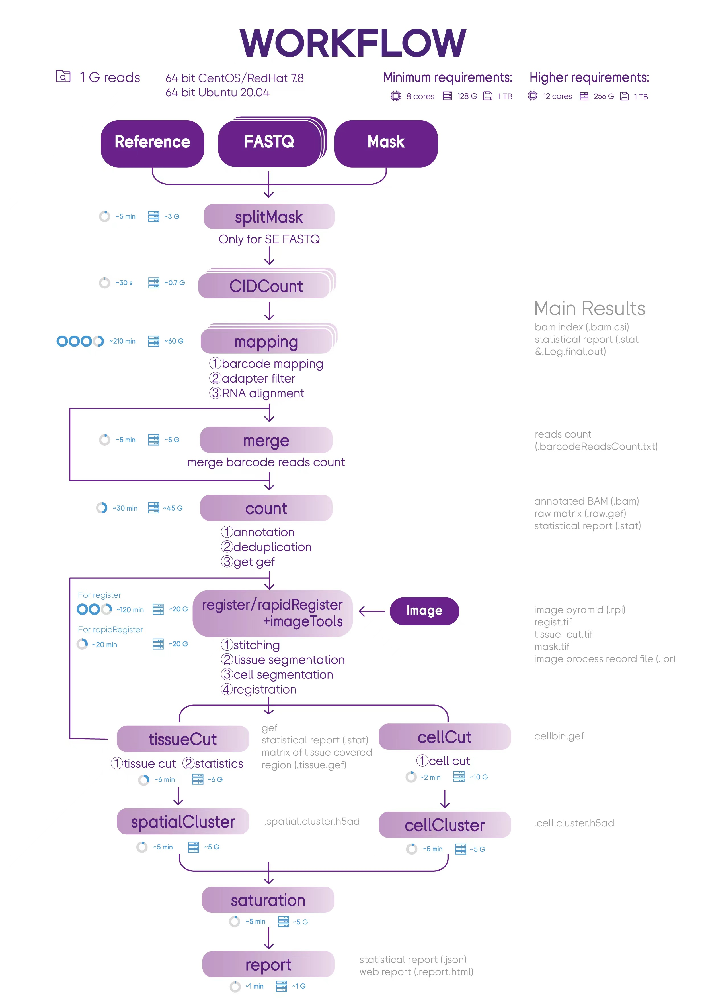

# SAW: Stereo-seq Analysis Workflow
Workflow for analyzing Stereo-seq transcriptomic data. Stereo-seq Analysis Workflow (SAW) software suite is a set of pipelines bundled to map sequenced reads to their spatial location on the tissue section, quantify the corresponding gene expression levels and visually present spatial gene expression distribution.

**DockerHub Link: https://hub.docker.com/r/stomics/saw/tags**

##  Introduction
SAW processes the sequencing data of Stereo-seq to generate spatial gene expression matrices, and the users could take these files as the starting point to perform downstream analysis. SAW includes thirteen essential and suggest pipelines and auxiliary tools for supporting other handy functions.


##  System Requirements
###   Hardware
Stereo-seq Analysis Workflow (SAW) should be run on a Linux system that meets the following requirements:
* 8-core Intel or AMD processor (>24 cores recommended)
* 128GB RAM (>256GB recommended)
* 1TB free disk space or higher
* 64-bit CentOS/RedHat 7.8 or Ubuntu 20.04

###   Software
* Singularity: a container platform
* SAW in the Singularity Image File (SIF) format
* ImageQC >= v1.1.0, ImageStudio >= v1.0.0

####   Quick installation of Singularity
```
## On Red Hat Enterprise Linux or CentOS install the following dependencies:
$ sudo yum update -y && \
     sudo yum groupinstall -y 'Development Tools' && \
     sudo yum install -y \
     openssl-devel \
     libuuid-devel \
     libseccomp-devel \
     wget \
     squashfs-tools \
     cryptsetup

## On Ubuntu or Debian install the following dependencies:
$ sudo apt-get update && sudo apt-get install -y \
    build-essential \
    uuid-dev \
    libgpgme-dev \
    squashfs-tools \
    libseccomp-dev \
    wget \
    pkg-config \
    git \
    cryptsetup-bin

## Install Go
$ export VERSION=1.14.12 OS=linux ARCH=amd64 && \
    wget https://dl.google.com/go/go$VERSION.$OS-$ARCH.tar.gz && \
    sudo tar -C /usr/local -xzvf go$VERSION.$OS-$ARCH.tar.gz && \
    rm go$VERSION.$OS-$ARCH.tar.gz

$ echo 'export GOPATH=${HOME}/go' >> ~/.bashrc && \
    echo 'export PATH=/usr/local/go/bin:${PATH}:${GOPATH}/bin' >> ~/.bashrc && \
    source ~/.bashrc

## Install singularity on CentOS without compile
$ yum install -y singularity
```
**For additional help or support, please visit https://sylabs.io/guides/3.8/admin-guide/installation.html**

####   Quick download SAW from DockerHub
Currently, the latest version of SAW in DockerHub is 06.0.0. You can download SAW by running the following command:
```
singularity build SAW_<version>.sif docker://stomics/saw:<version>
```


##   [Preparation](https://github.com/BGIResearch/SAW/tree/main/script/pre_buildIndexedRef)
###    Build index for reference genome
A genome index has to be constructed before performing data mapping. The index files are used as reference when aligning reads. You can prepare the indexed reference before run SAW as follow:
```
singularity exec SAW_<version>.sif mapping --runMode genomeGenerate \
    --genomeDir reference/STAR_SJ100 \
    --genomeFastaFiles reference/genome.fa \
    --sjdbGTFfile reference/genes.gtf \
    --sjdbOverhang 99 \
    --runThreadN 12
```
**For more information, refer to "script/pre_buildIndexedRef"**

###    Get Stereo-seq Chip T mask file
- If you want to access mask file (.h5/.bin) for your own data, please contact BGI-FAS team.
- To access mask file for published paper, please go to [CNGBdb](https://db.cngb.org/) > [STOmicsDB](https://db.cngb.org/stomics) > [Collections](https://db.cngb.org/stomics/collections).


##  RUN
### Usage
```
# for saw_v6.0.0
usage: sh <stereoPipeline.sh> -genomeSize -splitCount -maskFile -fq1 -fq2 -refIndex -genomeFile -speciesName -tissueType -annotationFile -outDir -imageRecordFile -imageCompressedFile -doCellBin -threads -sif
    -genomeSize : file size of the genome.fa (GiB) 
    -splitCount : count of split Stereo-seq Chip T Mask file, usually 16 for SE+Q4 FASTQ data and 1 for PE+Q40 FASTQ data
    -maskFile : Stereo-seq Chip T Mask file path
    -fq1 : FASTQ file path of read1, if there are more than one FASTQ file, please separate them with comma, e.g:lane1_read_1.fq.gz,lane2_read_1.fq.gz
    -fq2 : FASTQ file path of read2, if there are more than one FASTQ file, please separate them with comma, not requested for 'SE+Q4' FASTQ data, e.g:lane1_read_2.fq.gz,lane2_read_2.fq.gz    
    -refIndex : reference genome indexed folder, please build before running SAW analysis
    -speciesName : species of the sample
    -tissueType : tissue type of the sample
    -annotationsFile :  annotations file in GFF or GTF format, the file must contain gene and exon annotations
    -threads : the number of threads to be used for running this pipeline
    -sif : SAW sif file path
    -outDir : output directory path
    -imageRecordFile : image process record file (*.ipr) generated by ImageQC software, optional
    -imageCompressedFile : image file (*.tar.gz) generated by ImageQC software, optional 
    -doCellBin : [Y/N], optional

# 1GiB=1024M=10241024KB=10241024*1024B
# SAW version : v6.0.0
```
```
# for saw_v5.1.3 and saw_v5.4.0 and saw_v5.5.3
usage: sh <stereoPipeline.sh> -genomeSize -splitCount -maskFile -fq1 -fq2 -refIndex -genomeFile -speciesName -tissueType -annotationFile -outDir -imageRecordFile -imageCompressedFile -doCellBin -threads -sif
    -genomeSize : file size of the genome.fa (GiB) 
    -splitCount : count of split Stereo-seq Chip T Mask file, usually 16 for SE+Q4 FASTQ data and 1 for PE+Q40 FASTQ data
    -maskFile : Stereo-seq Chip T Mask file path
    -fq1 : FASTQ file path of read1, if there are more than one FASTQ file, please separate them with comma, e.g:lane1_read_1.fq.gz,lane2_read_1.fq.gz
    -fq2 : FASTQ file path of read2, if there are more than one FASTQ file, please separate them with comma, not requested for 'SE+Q4' FASTQ data, e.g:lane1_read_2.fq.gz,lane2_read_2.fq.gz    
    -refIndex : reference genome indexed folder, please build before running SAW analysis
    -speciesName : species of the sample
    -tissueType : tissue type of the sample
    -annotationsFile :  annotations file in GFF or GTF format, the file must contain gene and exon annotations
    -threads : the number of threads to be used for running this pipeline
    -sif : SAW sif file path
    -outDir : output directory path
    -imageRecordFile : image process record file (*.ipr) generated by ImageQC software, optional
    -imageCompressedFile : image file (*.tar.gz) generated by ImageQC software, optional 
    -doCellBin : [Y/N], optional

# 1GiB=1024M=10241024KB=10241024*1024B
# SAW version : v5.1.3, v5.4.0, v5.5.3
```
```
# for saw_beta_v4.1.0 & saw_v4.1.0
usage: sh <stereoRun.sh> -m maskFile -1 read1 -2 read2 -g indexedGenome -a annotationFile -o outDir -i image -t threads -s visualSif -c genomeSize
    -m Stereo-seq Chip T Mask file path
    -1 FASTQ file path of read1, if there are more than one FASTQ file, please separate them with comma, e.g:lane1_read_1.fq.gz,lane2_read_1.fq.gz
    -2 FASTQ file path of read2, if there are more than one FASTQ file, please separate them with comma, e.g:lane1_read_2.fq.gz,lane2_read_2.fq.gz
    -g genome that has been indexed by STAR
    -a annotation file in gff or gtf format, the file must contain gene and exon annotation, and also the transript annotation
    -o output directory path
    -i image directory path, must contains SN*.tar.gz and SN*.json file generated by ImageQC software, optional
    -t number of thread set to be used for running this pipeline
    -s SAW docker image that packed analysis softwares
    -c genome file size (GiB, Gibibyte)

# 1GiB=1024M=10241024KB=10241024*1024B
# SAW version : v4.1.0
```

###   Example: Running the entire workflow
For SAW_v4, please use the [stereoRun_singleLane_v4.1.0.sh](https://github.com/BGIResearch/SAW/blob/main/script/stereoRun_singleLane_v4.1.0.sh) or [stereoRun_multiLane_v4.1.0.sh](https://github.com/BGIResearch/SAW/blob/main/script/stereoRun_multiLane_v4.0.0.sh) to run the whole workflow.

For SAW_v5, please use the [stereoPipeline_v5.5.0.sh](https://github.com/BGIResearch/SAW/blob/main/script/stereoPipeline_v5.5.0.sh) to run the whole workflow.

For SAW_v6, please use the [stereoPipeline_v6.0.0.sh](https://github.com/BGIResearch/SAW/blob/main/script/stereoPipeline_v6.0.0.sh) to run the whole workflow.

####    Run stereoPipeline.sh bash script
```
cd <Your Working Directory>

ulimit -n 10240
ulimit -v 33170449147
NUMBA_CACHE_DIR=<Your Working Directory>

dataDir=<Your Working Directory>/rawData
outDir=<Your Working Directory>/result

export SINGULARITY_BIND=$dataDir,$outDir

## Choose from the following scenarios

## Scenario 1: input image and run cell bin
bash stereoPipeline.sh \
    -sif $dataDir/SAW/SAW_<version>.sif \
    -genomeSize 5 \
    -splitCount 1 \  ## 16 or 64 for SE, 1 for PE
    -maskFile $dataDir/mask/SN.h5 \
    -fq1 $dataDir/reads/lane1_read_1.fq.gz,...,$dataDir/reads/laneN_read_1.fq.gz  \
    -fq2 $dataDir/reads/lane1_read_2.fq.gz,...,$dataDir/reads/laneN_read_2.fq.gz \ # [optional] when the sequenced data is in PE format
    -speciesName <speciesName> \
    -tissueType <tissueName> \
    -refIndex $dataDir/reference/STAR_SJ100 \
    -annotationFile $dataDir/reference/genes.gtf \  ## GFF or GTF
    -threads 16 \
    -outDir $outDir/result \
    -imageRecordFile $dataDir/image/<SN_date_time_version>.ipr \ # [optional] when image is given and has passed QC
    -imageCompressedFile $dataDir/image/<SN_date_time_version>tar.gz \ # [optional] when image is given and has passed QC
    -doCellBin Y  # [optional] when you want to do the cell segmentation and get cell gene expression data

## Scenario 2: input image but no need for cell bin
bash stereoPipeline.sh \
    -sif $dataDir/SAW/SAW_<version>.sif \
    -genomeSize 5 \
    -splitCount 1 \  ## 16 or 64 for SE, 1 for PE
    -maskFile $dataDir/mask/SN.h5 \
    -fq1 $dataDir/reads/lane1_read_1.fq.gz,...,$dataDir/reads/laneN_read_1.fq.gz  \
    -fq2 $dataDir/reads/lane1_read_2.fq.gz,...,$dataDir/reads/laneN_read_2.fq.gz \ # [optional] when the sequenced data is in PE format
    -speciesName <speciesName> \
    -tissueType <tissueName> \
    -refIndex $dataDir/reference/STAR_SJ100 \
    -annotationFile $dataDir/reference/genes.gtf \  ## GFF or GTF
    -threads 16 \
    -outDir $outDir/result \
    -imageRecordFile $dataDir/image/<SN_date_time_version>.ipr \ # [optional] when image is given and has passed QC
    -imageCompressedFile $dataDir/image/<SN_date_time_version>tar.gz \ # [optional] when image is given and has passed QC
    -doCellBin N  # [optional] when you want to do the cell segmentation and get cell gene expression data

## Scenario 3: no image
bash stereoPipeline.sh \
    -sif $dataDir/SAW/SAW_<version>.sif \
    -genomeSize 5 \
    -splitCount 1 \  ## 16 or 64 for SE, 1 for PE
    -maskFile $dataDir/mask/SN.h5 \
    -fq1 $dataDir/reads/lane1_read_1.fq.gz,...,$dataDir/reads/laneN_read_1.fq.gz  \
    -fq2 $dataDir/reads/lane1_read_2.fq.gz,...,$dataDir/reads/laneN_read_2.fq.gz \ # [optional] when the sequenced data is in PE format
    -speciesName <speciesName> \
    -tissueType <tissueName> \
    -refIndex $dataDir/reference/STAR_SJ100 \
    -annotationFile $dataDir/reference/genes.gtf \  ## GFF or GTF
    -threads 16 \
    -outDir $outDir/result
```
####    Run stereoRun_singleLane_v4.1.0.sh bash script
If only one lane sequencing data was given, run the stereoRun_singleLane_v4.1.0.sh bash script as the following:
```
ulimit -n 10240 
dataDir=/Full/Path/Of/Input/File 
outDir=/Full/Path/Of/Output/File 
export SINGULARITY_BIND=$dataDir,$outDir
bash stereoRun_singleLane.sh \
    -m $dataDir/mask/SN.h5 \
    -1 $dataDir/reads/lane1_read_1.fq.gz \
    -2 $dataDir/reads/lane1_read_2.fq.gz \
    -g $dataDir/reference/STAR_SJ100 \
    -a $dataDir/reference/genes.gtf \
    -s $dataDir/SAW/SAW_<version>.sif \
    -c genome_size \ # (GiB, Gibibyte)
    -i $dataDir/SN/image_dir_path \ # [option] when tissue image was given
    -o $outDir/result
    
# 1GiB=1024M=10241024KB=10241024*1024B
# SAW version : v4.1.0
```
####    Run stereoRun_multiLane_v4.1.0.sh bash script
If more than one lane sequencing data was given, run the stereoRun_multiLane_v4.1.0.sh script as the following:
```
ulimit -n 10240 
dataDir=/Full/Path/Of/Input/File 
outDir=/Full/Path/Of/Output/File 
export SINGULARITY_BIND=$dataDir,$outDir
bash stereoRun_multiLane.sh \
    -m $dataDir/mask/SN.h5 \
    -1 $dataDir/reads/lane1_read_1.fq.gz,$dataDir/reads/lane2_read_1.fq.gz \
    -2 $dataDir/reads/lane1_read_2.fq.gz,$dataDir/reads/lane2_read_2.fq.gz \
    -g $dataDir/reference/STAR_SJ100 \
    -a $dataDir/reference/genes.gtf \
    -s $dataDir/SAW/SAW_<version>.sif \
    -c genome_size \ # (GiB, Gibibyte)
    -i $dataDir/SN/image_dir_path \ # [option] when tissue image was given
    -o $outDir/result
    

# 1GiB=1024M=10241024KB=10241024*1024B
# SAW version : v4.1.0
```
####    Run stereoRun_multiLane_v2.1.0.sh bash script
If more than one lane sequencing data was given, run the stereoRun_multiLane_v2.1.0.sh script as the following:
```
ulimit -n 10240 
dataDir=/Full/Path/Of/Input/File 
outDir=/Full/Path/Of/Output/File 
export SINGULARITY_BIND=$dataDir,$outDir
bash stereoRun_multiLane.sh \
    -m $dataDir/mask/SN.h5 \
    -1 $dataDir/reads/lane1_read_1.fq.gz,$dataDir/reads/lane2_read_1.fq.gz \
    -2 $dataDir/reads/lane1_read_2.fq.gz,$dataDir/reads/lane2_read_2.fq.gz \
    -g $dataDir/reference/STAR_SJ100 \
    -a $dataDir/reference/genes.gtf \
    -o $outDir/result \
    -i $dataDir/SN/image_dir_path \ # [option] when tissue image was given
    -t 24 \
    -s $dataDir/SAW/SAW_<version>.sif


# 1GiB=1024M=10241024KB=10241024*1024B
# SAW version : v2.1.0
```
