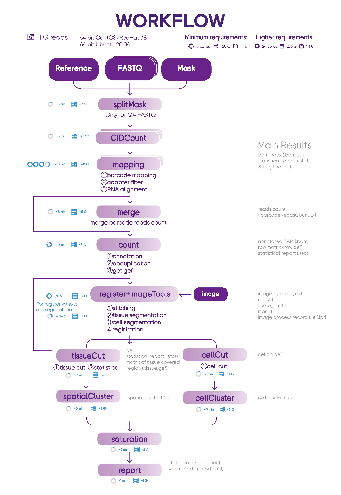

# SAW: Stereo-seq Analysis Workflow
Workflow for analyzing Stereo-seq transcriptomic data. Stereo-seq Analysis Workflow (SAW) software suite is a set of pipelines bundled to map sequenced reads to their spatial location on the tissue section, quantify the corresponding gene expression levels and visually present spatial gene expression distribution.

**DockerHub Link: https://hub.docker.com/r/stomics/saw/tags**

##  Introduction
SAW processes the sequencing data of Stereo-seq to generate spatial gene expression matrices, and the users could take these files as the starting point to perform downstream analysis. SAW includes thirteen essential and suggest pipelines and auxiliary tools for supporting other handy functions.


##  System Requirements
###   Hardware
Stereo-seq Analysis Workflow (SAW) should be run on a Linux system that meets the following requirements:
* 8-core Intel or AMD processor (>24 cores recommended)
* 128GB RAM (>256GB recommended)
* 1TB free disk space or higher
* 64-bit CentOS/RedHat 7.8 or Ubuntu 20.04

###   Software
* Singularity: a container platform
* SAW in the Singularity Image File (SIF) format
* ImageStudio >= v3.0
* StereoMap >= v3.0

####   Quick installation of Singularity
```
## On Red Hat Enterprise Linux or CentOS install the following dependencies:
$ sudo yum update -y && \
     sudo yum groupinstall -y 'Development Tools' && \
     sudo yum install -y \
     openssl-devel \
     libuuid-devel \
     libseccomp-devel \
     wget \
     squashfs-tools \
     cryptsetup

## On Ubuntu or Debian install the following dependencies:
$ sudo apt-get update && sudo apt-get install -y \
    build-essential \
    uuid-dev \
    libgpgme-dev \
    squashfs-tools \
    libseccomp-dev \
    wget \
    pkg-config \
    git \
    cryptsetup-bin

## Install Go
$ export VERSION=1.14.12 OS=linux ARCH=amd64 && \
    wget https://dl.google.com/go/go$VERSION.$OS-$ARCH.tar.gz && \
    sudo tar -C /usr/local -xzvf go$VERSION.$OS-$ARCH.tar.gz && \
    rm go$VERSION.$OS-$ARCH.tar.gz

$ echo 'export GOPATH=${HOME}/go' >> ~/.bashrc && \
    echo 'export PATH=/usr/local/go/bin:${PATH}:${GOPATH}/bin' >> ~/.bashrc && \
    source ~/.bashrc

## Install singularity on CentOS without compile
$ yum install -y singularity
```
**For additional help or support, please visit https://sylabs.io/guides/3.8/admin-guide/installation.html**

####   Quick download SAW from DockerHub
Currently, the latest version of SAW in DockerHub is 07.0.0. You can download SAW by running the following command:
```
singularity build SAW_<version>.sif docker://stomics/saw:<version>
```
#####   All accessible versions on DockerHub
```
singularity build SAW_7.0.sif docker://stomics/saw:07.0.0
singularity build SAW_6.1.sif docker://stomics/saw:06.1.3
singularity build SAW_6.1.sif docker://stomics/saw:06.1.0
singularity build SAW_6.0.sif docker://stomics/saw:06.0.2
singularity build SAW_5.5.sif docker://stomics/saw:05.5.4
singularity build SAW_5.4.sif docker://stomics/saw:05.4.0
singularity build SAW_5.1.sif docker://stomics/saw:05.1.3
singularity build SAW_4.1.sif docker://stomics/saw:04.1.0
singularity build SAW_4.0.sif docker://stomics/saw:04.0.0
singularity build SAW_2.1.sif docker://stomics/saw:02.1.0
singularity build SAW_2.0.sif docker://stomics/saw:02.0.0
singularity build SAW_1.0.sif docker://stomics/saw:01.0.0
```


##   [Preparation](https://github.com/BGIResearch/SAW/tree/main/script/pre_buildIndexedRef)
###    Build index for reference genome
A genome index has to be constructed before performing data mapping. The index files are used as reference when aligning reads. You can prepare the indexed reference before run SAW as follow:
```

singularity exec SAW_<version>.sif mapping --runMode genomeGenerate \
    --genomeDir reference/STAR_SJ100 \
    --genomeFastaFiles reference/genome.fa \
    --sjdbGTFfile reference/genes.gtf \
    --sjdbOverhang 99 \
    --runThreadN 12
```
**Because of update of `mapping` module for computational efficiency, from SAW V6.1, index for reference genome has to be reconstructed with the same commands.**  
**For more information, refer to "script/pre_buildIndexedRef"**

###    Get Stereo-seq Chip T mask file
- If you want to access mask file (.h5/.bin) for your own data, please contact BGI-FAS team.
- To access mask file for published paper, please go to [CNGBdb](https://db.cngb.org/) > [STOmicsDB](https://db.cngb.org/stomics) > [Collections](https://db.cngb.org/stomics/collections).


##  RUN
### Usage
```
# for saw_v7.0
usage: sh stereoPipeline_v7.0.sh -splitCount -maskFile -fq1 -fq2 -refIndex -genomeFile -speciesName -tissueType -annotationFile -outDir -imageRecordFile -imageCompressedFile -doCellBin -rRNARemove -threads -sif
    -splitCount : count of splited stereochip mask file, usually 16 for SE+Q4 fq data and 1 for PE+Q40 fq data
    -maskFile : stereochip mask file
    -fq1 : fastq file path of read1, if there are more than one fastq file, please separate them with comma, e.g:lane1_read_1.fq.gz,lane2_read_1.fq.gz
    -fq2 : fastq file path of read2, if there are more than one fastq file, please separate them with comma, not requested for 'Q4' fastq data, e.g:lane1_read_2.fq.gz,lane2_read_2.fq.gz
    -refIndex : reference genome indexed folder, please build index before SAW analysis run
    -speciesName : specie of the sample
    -tissueType : tissue type of the sample
    -annotationFile :  annotations file in gff or gtf format, the file must contain gene and exon annotations
    -outDir : output directory path
    -imageRecordFile : image file(*.ipr) generated by ImageQC/ImageStudio software, not requested
    -imageCompressedFile : image file(*.tar.gz) generated by ImageQC/ImageStudio software, not requested  
    -doCellBin : [Y/N]
    -rRNAremove : [Y/N]
    -threads : the number of threads to be used in running the pipeline
    -sif : the file format of the visual software

# 1GiB=1024M=10241024KB=10241024*1024B
# SAW version : v7.0
```

```
# for for saw_v7.0_muanal
# part1
usage: sh stereoPipeline_v7.0_manual_part1.sh -genomeSize -splitCount -maskFile -fq1 -fq2 -speciesName -tissueType -refIndex -annotationFile -imageRecordFile -imageCompressedFile -sif -threads -outDir
    -splitCount : count of splited stereochip mask file, usually 16 for SE+Q4 fq data and 1 for PE+Q40 fq data
    -maskFile : stereochip mask file
    -fq1 : fastq file path of read1, if there are more than one fastq file, please separate them with comma, e.g:lane1_read_1.fq.gz,lane2_read_1.fq.gz
    -fq2 : fastq file path of read2, if there are more than one fastq file, please separate them with comma, not requested for 'SE+Q4' fastq data, e.g:lane1_read_2.fq.gz,lane2_read_2.fq.gz
    -speciesName : specie of the sample  
    -tissueType : tissue type of the sample	
	-refIndex : reference genome indexed folder, please build IT before SAW analysis run
    -annotationFile :  annotations file in gff or gtf format, the file must contain gene and exon annotations
    -rRNAremove : [Y/N]
    -imageRecordFile : image file(*.ipr) generated by ImageStudio software, not requested
    -imageCompressedFile : image file(*.tar.gz) generated by ImageStudio software, not requested
    -sif : the file format of the visual software
    -threads : the number of threads to be used in running the pipeline
    -outDir : output directory path


# part2
usage: sh stereoPipeline_v7.0_manual_part2.sh -SN -dataDir -registJson -speciesName -tissueType -outDir -imageRecordFile -imageCompressedFile -doCellBin -threads -sif
    -SN : sample id
    -dataDir : output directory of gene expression matrix result 
    -registJson : manual registration json file
    -speciesName : specie of the sample
    -tissueType : tissue type of the sample
    -outDir : output directory path
    -imageRecordFile : image file(*.ipr) generated by ImageStudio software
    -imageCompressedFile : image file(*.tar.gz) generated by ImageStudio software
    -doCellBin : [Y/N]
    -threads : the number of threads to be used in running the pipeline
    -sif : the file format of the visual software


# 1GiB=1024M=10241024KB=10241024*1024B
# SAW version : v7.0
```


###   Example: Running the entire workflow

For SAW_v7.0, please use the [stereoPipeline_v7.0.sh](https://github.com/STOmics/SAW/blob/main/Scripts/stereoPipeline_v7.0.sh) to run the whole workflow.

For SAW_v7_manual, please use the [stereoPipeline_v7.0_manual_part1.sh](https://github.com/STOmics/SAW/blob/main/Scripts/stereoPipeline_v7.0_manual_part1.sh) and [stereoPipeline_v7.0_manual_part2.sh](https://github.com/STOmics/SAW/blob/main/Scripts/stereoPipeline_v7.0_manual_part2.sh) to finish the manual processing. 

####    Run stereoPipeline.sh bash script
```
cd <Your Working Directory>

ulimit -n 10240
ulimit -v 33170449147
NUMBA_CACHE_DIR=<Your Working Directory>

dataDir=<Your Working Directory>/rawData
outDir=<Your Working Directory>/result

export SINGULARITY_BIND=$dataDir,$outDir

## Choose from the following scenarios

## Scenario 1: input image and run cell bin
bash stereoPipeline.sh \
    -sif $dataDir/SAW/SAW_<version>.sif \
    -splitCount 1 \  ## 16 or 64 for Q4, 1 for Q40
    -maskFile $dataDir/mask/SN.h5 \
    -fq1 $dataDir/reads/lane1_read_1.fq.gz,...,$dataDir/reads/laneN_read_1.fq.gz  \
    -fq2 $dataDir/reads/lane1_read_2.fq.gz,...,$dataDir/reads/laneN_read_2.fq.gz \ # [optional] when the sequenced data is in PE format
    -speciesName <speciesName> \
    -tissueType <tissueName> \
    -refIndex $dataDir/reference/STAR_SJ100 \
    -annotationFile $dataDir/reference/genes.gtf \  ## GFF or GTF
    -rRNAremove : N \
    -threads 16 \
    -outDir $outDir/result \
    -imageRecordFile $dataDir/image/<SN_date_time_version>.ipr \ # [optional] when image is given and has passed QC
    -imageCompressedFile $dataDir/image/<SN_date_time_version>tar.gz \ # [optional] when image is given and has passed QC
    -doCellBin Y  # [optional] when you want to do the cell segmentation and get cell gene expression data

## Scenario 2: input image but no need for cell bin
bash stereoPipeline.sh \
    -sif $dataDir/SAW/SAW_<version>.sif \
    -splitCount 1 \  ## 16 or 64 for Q4, 1 for Q40
    -maskFile $dataDir/mask/SN.h5 \
    -fq1 $dataDir/reads/lane1_read_1.fq.gz,...,$dataDir/reads/laneN_read_1.fq.gz  \
    -fq2 $dataDir/reads/lane1_read_2.fq.gz,...,$dataDir/reads/laneN_read_2.fq.gz \ # [optional] when the sequenced data is in PE format
    -speciesName <speciesName> \
    -tissueType <tissueName> \
    -refIndex $dataDir/reference/STAR_SJ100 \
    -annotationFile $dataDir/reference/genes.gtf \  ## GFF or GTF
    -rRNAremove : N \
    -threads 16 \
    -outDir $outDir/result \
    -imageRecordFile $dataDir/image/<SN_date_time_version>.ipr \ # [optional] when image is given and has passed QC
    -imageCompressedFile $dataDir/image/<SN_date_time_version>tar.gz \ # [optional] when image is given and has passed QC
    -doCellBin N  # [optional] when you want to do the cell segmentation and get cell gene expression data

## Scenario 3: no image
bash stereoPipeline.sh \
    -sif $dataDir/SAW/SAW_<version>.sif \
    -splitCount 1 \  ## 16 or 64 for Q4, 1 for Q40
    -maskFile $dataDir/mask/SN.h5 \
    -fq1 $dataDir/reads/lane1_read_1.fq.gz,...,$dataDir/reads/laneN_read_1.fq.gz  \
    -fq2 $dataDir/reads/lane1_read_2.fq.gz,...,$dataDir/reads/laneN_read_2.fq.gz \ # [optional] when the sequenced data is in PE format
    -speciesName <speciesName> \
    -tissueType <tissueName> \
    -refIndex $dataDir/reference/STAR_SJ100 \
    -annotationFile $dataDir/reference/genes.gtf \  ## GFF or GTF
    -rRNAremove : N \
    -threads 16 \
    -outDir $outDir/result
```
