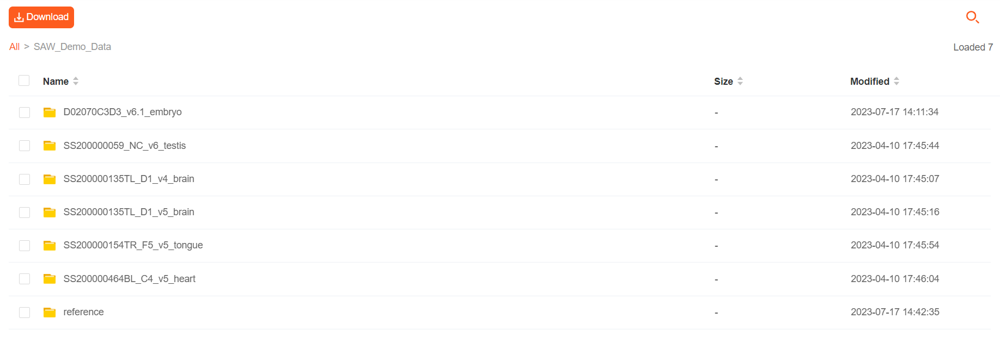

# TEST DATA
##  Demo data basic information

|  | SN | Reference | Tissue Type |
| ----------- | ----------- | ----------- | ----------- |
| Demo 1 | SS200000135TL_D1 | mouse | brain |
| Demo 2 | SS200000154TR_F5 | mouse | tongue |
| Demo 3 | SS200000464BL_C4 | mouse | heart |
| Demo 4 | SS200000059_NC | mouse | testis |


##  Download data from Raysync
**Link: http://116.6.21.110:8090/share/QJKAO6hGUpTPbuYH7Dvi**

**Access password: ltVO**



| Demo Data Directory | SAW Version |
| ----------- | ----------- |
| SS200000135TL_D1_v4_brain | <= V4.1.0  |
| SS200000135TL_D1_v5_brain | >= V5.1.3 |
| SS200000154TR_F5_v5_tongue | >= V5.1.3 |
| SS200000464BL_C4_v5_heart | >= V5.1.3 |
| SS200000059_NC_v6_testis | >= V6.0.0 |


## Raw Data Directory Structure
Here we take `SS200000135TL_D1_v5` as an example. 
```
$ tree
.
|-- image
|   |-- SS200000135TL_D1_20220527_201353_1.1.0.ipr
|   `-- SS200000135TL_D1_20220527_201353_1.1.0.tar.gz
|-- mask
|   `-- SS200000135TL_D1.barcodeToPos.h5
|-- md5
|-- reads
|   |-- E100026571_L01_trim_read_1.fq.gz
|   `-- E100026571_L01_trim_read_2.fq.gz
`-- reference
    |-- STAR_SJ100
    |   |-- Genome
    |   |-- SA
    |   |-- SAindex
    |   |-- chrLength.txt
    |   |-- chrName.txt
    |   |-- chrNameLength.txt
    |   |-- chrStart.txt
    |   |-- exonGeTrInfo.tab
    |   |-- exonInfo.tab
    |   |-- geneInfo.tab
    |   |-- genomeParameters.txt
    |   |-- genomeParameters_bkp.txt
    |   |-- sjdbInfo.txt
    |   |-- sjdbList.fromGTF.out.tab
    |   |-- sjdbList.out.tab
    |   `-- transcriptInfo.tab
    |-- genes.gtf
    `-- genome.fa

5 directories, 24 files
```
