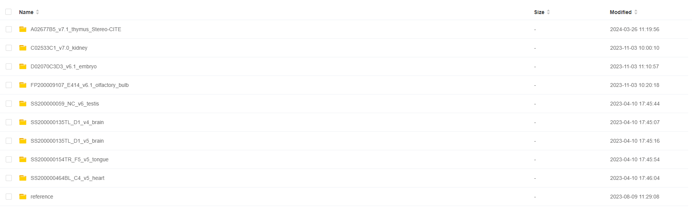

# TEST DATA
##  Demo data basic information
The HTML report may differ slightly from the StereoMap visualization data in Raysync due to version upgrades

|  | SN | Chip Size | Reference | Tissue Type | Image Type | HTML Report |
| -------------- | ----------- | ----------- | ----------- | ----------- | ----------- |----------- |
| Demo 1 | SS200000135TL_D1 | 1\*1 | mouse | brain | ssDNA | [SS200000135TL_D1.report.html](https://github.com/STOmics/SAW/blob/main/Test_Data/SS200000135TL_D1.report.html) <br> v7.0.1|
| Demo 2 | SS200000154TR_F5 | 1\*1 | mouse | tongue | ssDNA | [SS200000154TR_F5.report.html](https://github.com/STOmics/SAW/blob/main/Test_Data/SS200000154TR_F5.report.html) <br> v5.5.4 |
| Demo 3 | SS200000464BL_C4 | 1\*1 | mouse | heart | ssDNA | [SS200000464BL_C4.report.html](https://github.com/STOmics/SAW/blob/main/Test_Data/SS200000464BL_C4.report.html) <br> v6.1.3 |
| Demo 4 | SS200000059_NC | 1\*1 | mouse | testis | DAPI+mIF(AKAP3+TESK2) | [SS200000059_NC.report.html](https://github.com/STOmics/SAW/blob/main/Test_Data/SS200000059_NC.report.html) <br> v6.1.3 |
| Demo 5 | D02070C3D3 | 1\*2 | mouse | embryo | DAPI | [D02070C3D3.report.html](https://github.com/STOmics/SAW/blob/main/Test_Data/D02070C3D3.report.html) <br> v6.1.3 |
| Demo 6 | FP200009107_E414 | 0.5\*0.5 | mouse | olfactory bulb | DAPI | [FP200009107_E414.report.html](https://github.com/STOmics/SAW/blob/main/Test_Data/FP200009107_E414.report.html) <br> v6.1.3 |
| Demo 7 | C02533C1 | 1\*1 | mouse | kidney | H&E | [C02533C1.report.html](https://github.com/STOmics/SAW/blob/main/Test_Data/C02533C1.report.html) <br> v7.0.1 |
| Demo 8 | A02677B5 | 1\*1 | mouse | thymus | DAPI | [A02677B5.AnalysisReport.zip](https://github.com/STOmics/SAW/blob/main/Test_Data/A02677B5.AnalysisReport.zip) <br> v7.1.0 |

##  Download data from Raysync
**Raw data: http://116.6.21.110:8090/share/21bb9df9-e6c5-47c5-9aa8-29f2d23a6df4**


**StereoMap visualization data: http://116.6.21.110:8090/share/370fa513-f7c8-4a05-9db6-37549d518b72**


| Demo Data Directory | SAW Version |
| ----------- | ----------- |
| SS200000135TL_D1_v4_brain | <= V4.1.0  |
| SS200000135TL_D1_v5_brain | \>= V5.1.3 |
| SS200000154TR_F5_v5_tongue | \>= V5.1.3 |
| SS200000464BL_C4_v5_heart | \>= V5.1.3 |
| SS200000059_NC_v6_testis | \>= V6.0.0 |
| D02070C3D3_v6.1_embryo | \>= V6.1.0 |
| FP200009107_E414_v6.1_olfactory_bulb | \>= V6.1.0 |
| C02533C1_v7.0_kidney | \>= V7.0.0 |
| A02677B5_v7.1_thymus | \>= V7.1.0 |


## Raw Data Directory Structure
Here we take `SS200000135TL_D1_v5_brain` as an example for spatial transcriptomics workflow.
```
$ tree
.
|-- image
|   |-- SS200000135TL_D1_20220527_201353_1.1.0.ipr
|   `-- SS200000135TL_D1_20220527_201353_1.1.0.tar.gz
|-- mask
|   `-- SS200000135TL_D1.barcodeToPos.h5
|-- md5
|-- reads
|   |-- E100026571_L01_trim_read_1.fq.gz
|   `-- E100026571_L01_trim_read_2.fq.gz
`-- reference
    |-- STAR_SJ100
    |   |-- Genome
    |   |-- SA
    |   |-- SAindex
    |   |-- chrLength.txt
    |   |-- chrName.txt
    |   |-- chrNameLength.txt
    |   |-- chrStart.txt
    |   |-- exonGeTrInfo.tab
    |   |-- exonInfo.tab
    |   |-- geneInfo.tab
    |   |-- genomeParameters.txt
    |   |-- genomeParameters_bkp.txt
    |   |-- sjdbInfo.txt
    |   |-- sjdbList.fromGTF.out.tab
    |   |-- sjdbList.out.tab
    |   `-- transcriptInfo.tab
    |-- genes.gtf
    `-- genome.fa

5 directories, 24 files
```

Here we take  `A02677B5_v7.1_thymus` subset  (~1G RNA reads and ~0.5G Protein reads) as an example for spatial proteomics & transcriptomics workflow.
```
$ tree
.
|-- image
|   |-- A02677B5_SC_20240131_192213_3.0.3.ipr
|   `-- A02677B5_SC_20240131_192213_3.0.3.tar.gz
|-- mask
|   `-- A02677B5.barcodeToPos.h5
|-- md5
|-- STOmics-RNA
│       ├── V350248064_L01_read_1.fq.gz
│       ├── V350248064_L01_read_2.fq.gz
│       ├── V350248064_L02_read_1.fq.gz
│       ├── V350248064_L02_read_2.fq.gz
│       ├── V350248064_L03_read_1.fq.gz
│       `-- V350248064_L03_read_2.fq.gz
|-- STOmics-ADT
│   │   ├── E150023160_L01_11_1.fq.gz
│   │   `-- E150023160_L01_11_2.fq.gz
|-- protein-reference
|   `-- ProteinPanel_128_mouse.list
`-- reference
    |-- STAR_SJ100
    |   |-- chrLength.txt
    |   |-- chrNameLength.txt
    |   |-- chrName.txt
    |   |-- chrStart.txt
    |   |-- exonGeTrInfo.tab
    |   |-- exonInfo.tab
    |   |-- FMindex
    |   |-- geneInfo.tab
    |   |-- Genome
    |   |-- genomeParameters.txt
    |   |-- SA
    |   |-- SAindex
    |   |-- SAindexAux
    |   |-- sjdbInfo.txt
    |   |-- sjdbList.fromGTF.out.tab
    |   |-- sjdbList.out.tab
    |   `-- transcriptInfo.tab
    |-- genes.gtf
    `-- genome.fa     

7 directories, 32 files 
```